# Data Model Reference

A map of Grimoire's database schema - the tables, their foreign-key relationships, and
the notable constraints. The schema is defined by the SQLAlchemy models in
[`backend/models/`](../backend/models/) (`library.py`, `media.py`, `users.py`,
`campaigns.py`, `settings.py`); this document is a companion reference, so **keep it in
sync when you change a model**.

The backend runs on SQLite. All primary keys are 36-char UUID strings (`_uuid()`) except
`app_settings`, which is keyed by its `key` string. Timestamps are UTC (`_utcnow()`).

## Entity-Relationship Diagram

The diagram groups tables by their model file. Solid lines are foreign keys; the crow's-foot
end marks the "many" side. Media tables (`generic_maps`, `tokens`, `audio`) and the
`*_folders` tag tables have no foreign keys - they are linked to campaigns only indirectly,
through `campaign_resources` (a polymorphic `resource_type` + `resource_id`, not a real FK),
so they are omitted from the relationship graph for clarity.

```mermaid
erDiagram
    users ||--o{ auth_sessions : "signed in from"
    users ||--o{ campaigns : owns
    users ||--o{ campaign_members : "member of"
    users ||--o{ bookmarks : has
    users ||--o{ favorites : has
    users ||--o{ saved_filters : has
    users ||--o{ user_themes : installs
    users ||--o{ session_availability : declares
    users ||--o{ player_session_notes : writes
    users ||--o{ wiki_pages : "created by"
    users ||--o{ wiki_page_shares : "shared with"
    users ||--o{ wiki_page_hidden : "hides"
    users ||--o{ wiki_templates : "created by"
    users ||--o{ campaign_resource_shares : "shared with"
    users ||--o{ campaign_files : "uploaded by"

    game_systems ||--o{ books : contains
    game_systems ||--o{ campaigns : "system for"
    game_systems ||--o{ game_systems : "container of"

    genres ||--o{ genres : "parent of"

    books ||--o{ bookmarks : "bookmarked in"

    campaigns ||--o{ campaign_members : has
    campaigns ||--o{ campaign_resources : links
    campaigns ||--o{ campaign_categories : groups
    campaigns ||--o{ campaign_files : stores
    campaigns ||--o{ session_notes : has
    campaigns ||--|| campaign_schedules : "scheduled by"
    campaigns ||--o{ session_availability : tracks
    campaigns ||--o{ wiki_pages : contains
    campaigns ||--o{ wiki_templates : owns
    campaigns ||--o{ wiki_page_links : "scoped to"
    campaigns ||--o{ campaigns : "parent of"

    campaign_resources ||--o{ campaign_resource_shares : "shared via"
    campaign_categories ||--o{ campaign_resources : categorizes
    campaign_categories ||--o{ wiki_pages : "categorizes (legacy)"

    session_notes ||--o{ player_session_notes : has
    session_notes ||--|| gm_session_notes : has

    wiki_pages ||--o{ wiki_page_shares : "shared via"
    wiki_pages ||--o{ wiki_page_hidden : "hidden via"
    wiki_pages ||--o{ wiki_pages : "parent of"
    wiki_pages ||--o{ wiki_page_links : "source of"
    wiki_pages ||--o{ wiki_page_links : "target of"

    tags ||--o{ resource_tags : "applied via"
```

## Foreign keys

There are 34 `ForeignKey` declarations across the models, plus the three self-referential
keys (`campaigns.parent_campaign_id`, `wiki_pages.parent_id`, `genres.parent_id`) and the
polymorphic soft links from `campaign_resources`/`favorites`/`resource_tags`, which are
*not* declared foreign keys.

| From (table.column) | To (table.column) | Notes |
| --- | --- | --- |
| `books.game_system_id` | `game_systems.id` | nullable; a book may be unassigned |
| `game_systems.parent_id` | `game_systems.id` | self-referential; nullable. Set on the child systems of a container folder (issues #261/#262) |
| `genres.parent_id` | `genres.id` | self-referential; nullable (tiered genres) |
| `bookmarks.user_id` | `users.id` | |
| `bookmarks.book_id` | `books.id` | |
| `favorites.user_id` | `users.id` | `item_id` is a soft link (not a FK) |
| `saved_filters.user_id` | `users.id` | per-user sort/filter presets |
| `user_themes.user_id` | `users.id` | per-user installed colour themes |
| `auth_sessions.user_id` | `users.id` | one row per login session; deleted with the user |
| `campaigns.owner_id` | `users.id` | the GM / creator |
| `campaigns.parent_campaign_id` | `campaigns.id` | self-referential; nullable |
| `campaigns.system_id` | `game_systems.id` | nullable; falls back to `system_name` |
| `campaign_members.campaign_id` | `campaigns.id` | |
| `campaign_members.user_id` | `users.id` | |
| `campaign_resources.campaign_id` | `campaigns.id` | |
| `campaign_resources.category_id` | `campaign_categories.id` | nullable |
| `campaign_resource_shares.resource_id` | `campaign_resources.id` | |
| `campaign_resource_shares.user_id` | `users.id` | |
| `campaign_categories.campaign_id` | `campaigns.id` | |
| `campaign_files.campaign_id` | `campaigns.id` | |
| `campaign_files.uploaded_by_id` | `users.id` | nullable |
| `campaign_schedules.campaign_id` | `campaigns.id` | one-to-one (`unique`) |
| `session_notes.campaign_id` | `campaigns.id` | |
| `session_availability.campaign_id` | `campaigns.id` | |
| `session_availability.user_id` | `users.id` | |
| `player_session_notes.session_id` | `session_notes.id` | |
| `player_session_notes.user_id` | `users.id` | |
| `gm_session_notes.session_id` | `session_notes.id` | one-to-one (`unique`) |
| `wiki_pages.campaign_id` | `campaigns.id` | |
| `wiki_pages.created_by_id` | `users.id` | nullable |
| `wiki_pages.parent_id` | `wiki_pages.id` | self-referential; nesting |
| `wiki_pages.category_id` | `campaign_categories.id` | legacy; nullable |
| `wiki_templates.campaign_id` | `campaigns.id` | per-campaign copies |
| `wiki_templates.created_by_id` | `users.id` | nullable |
| `wiki_page_shares.page_id` | `wiki_pages.id` | |
| `wiki_page_shares.user_id` | `users.id` | |
| `wiki_page_hidden.page_id` | `wiki_pages.id` | |
| `wiki_page_hidden.user_id` | `users.id` | |
| `wiki_page_links.campaign_id` | `campaigns.id` | |
| `wiki_page_links.source_page_id` | `wiki_pages.id` | |
| `wiki_page_links.target_page_id` | `wiki_pages.id` | |
| `resource_tags.tag_id` | `tags.id` | `ON DELETE CASCADE`; `resource_id` is a polymorphic soft link (not a FK) |

## Table reference

### Library - [`backend/models/library.py`](../backend/models/library.py)

| Table | Purpose | Key columns / constraints |
| --- | --- | --- |
| `game_systems` | A TTRPG system (D&D 5e, PbtA, …). | `name`, `slug` unique. `is_system_agnostic` flags cross-system content; `is_one_page` flags the special one-page/small-RPG collection (both grouped together in the library UI). Metadata (issue #202): `genres` (JSON list; supersedes the legacy scalar `genre`), `dice_materials` (JSON list), `system_family`, `parent_system` (mid-tier grouping, e.g. "Dungeons & Dragons"), `edition` (e.g. "5e"/"Red"; combines with `parent_system` for display), `license`, `year`, `urls` and `character_builder_urls` (JSON lists of `{label, url}`; supersede the legacy scalar `character_builder_url`). System containers (issues #261/#262): `container_kind` (`""`, `"parent"`, or `"one-page"`) marks a folder whose children are systems rather than categories, `parent_id` self-references the containing system, and `name_is_custom` stops the scanner overwriting a user-renamed system on rescan. |
| `books` | One PDF/document in the library. | `filepath` unique. `game_system_id` FK. Index `ix_books_indexer_queue` on `(indexed, mime_type)` drives the indexer. `indexed`/`index_failed`/`is_missing` track scan state. `index_error` holds the failure message, or the sentinel `image-only` (no text layer, OCR unavailable) / `ocr` (indexed via OCR). `ocr_pending` (indexed `ix_books_ocr_pending`) flags a scanned PDF queued for deferred OCR; `ocr_pages_done` is the per-page OCR checkpoint so a long book resumes rather than restarts after an interruption. `ocr_dpi` is an optional per-book OCR resolution override (NULL = global `OCR_DPI`), set when a book is re-OCR'd at a higher DPI via `POST /api/books/{id}/reindex`. Metadata (issue #202): `artists` and `genres` (JSON lists), `isbn`, `version`, `language`, `license` (per-book override of the system license - an OGL SRD inside a proprietary system), `urls` (JSON list of `{label, url}`; supersedes the legacy scalar `publisher_url`), and a variable-precision publication date `year`/`month`/`day` (all nullable - `year` may stand alone). Content identity (issue #284): `content_hash` (SHA-256 hex, indexed `ix_books_content_hash`) with `file_mtime` + `file_size` as the cheap gate - the scan only re-hashes when the stat signature changes, and the hash then tells a replaced file (same path, new bytes) from a moved one (new path, same bytes). NULL on rows predating the feature; backfilled on the next scan and deliberately not treated as a change. |
| `book_folders` | Folder tags for a book subcategory folder path (`{system_id}/{category}/{subfolder…}`), editable inline on the system page and surfaced on the tags page under Books. `tags` stores internal keys (display comes from the `tags` catalog); `tags.json` applies additively. | `path` unique. |
| `genres` | Curated genre lookup, tiered via a self-referential `parent_id` (e.g. Cyberpunk → Science Fiction). | `name` unique. `is_default` marks seeded rows; `sort_order` orders siblings. Children cascade-delete. |
| `system_families` | Curated system-family / engine lookup (PbtA, d20, Year Zero, …). | `name` unique. `is_default`, `sort_order`. |
| `parent_systems` | Curated parent-system lookup - the mid tier between a `system_family` and a concrete system (e.g. "Dungeons & Dragons"). | `name` unique. `is_default`, `sort_order`. Seeded empty. |
| `licenses` | Curated license lookup (OGL, ORC, CC-BY, Proprietary, …), used by systems and per-book overrides. | `name` unique. `is_default`, `sort_order`. |
| `dice_materials` | Curated dice / materials lookup for the system picker. | `name` unique. `group` (`Dice`\|`Cards`\|`Other`\|`Custom`). `is_default`, `sort_order`. |

### Media - [`backend/models/media.py`](../backend/models/media.py)

None of these tables carry foreign keys; they are linked to campaigns polymorphically via
`campaign_resources`.

| Table | Purpose | Key columns / constraints |
| --- | --- | --- |
| `generic_maps` | A map image not tied to a system. | `filepath` unique. `content_hash`/`file_mtime` as on `books`. |
| `tokens` | A token image for use on maps. | `filepath` unique. `is_explicit` gates by user preference. `content_hash`/`file_mtime` as on `books`. |
| `audio` | An audio track. | `filepath` unique. Embedded metadata (`title`, `artist`, `duration`, …) populated by the indexer. `content_hash`/`file_mtime` as on `books`. |
| `map_folders`, `token_folders`, `audio_folders` | Folder tags for a media folder path. `tags` is a JSON list of tag **internal keys**; display casing comes from the `tags` catalog. `tags.json` applies additively (adds keys, never removes/overwrites) since the library is read-only. | `path` unique. |

### Users - [`backend/models/users.py`](../backend/models/users.py)

| Table | Purpose | Key columns / constraints |
| --- | --- | --- |
| `users` | An authenticated account. | `username` unique; `email`, `opds_token`, `calendar_token`, `oidc_subject` unique + indexed. `calendar_token` authenticates the campaign calendar (ICS) feeds, which cannot send an `Authorization` header; it is deliberately separate from `opds_token` and the JWT so it can be rotated on its own, and is null until the user first requests a subscription URL. `role` ∈ `admin`/`gm`/`player`/`guest`. `is_guest` marks campaign-scoped guest accounts. `theme_mode` ∈ light/dark/system and `theme_id` names an installed `user_themes` row - both nullable, meaning the built-in dark palette. These hold the choice for the default app mode (Grimoire); `theme_by_mode` JSON holds `{app_mode: {mode, theme_id}}` for any other. |
| `bookmarks` | Per-user page/text bookmark in a book. | FKs `user_id`, `book_id`. Index `ix_bookmarks_user_book` on `(user_id, book_id)`. |
| `favorites` | Per-user favorite across books/maps/tokens. | FK `user_id`. Polymorphic `(item_type, item_id)`. **Unique** `(user_id, item_type, item_id)`. |
| `saved_filters` | Per-user named sort/filter preset for a library scope. | FK `user_id` (indexed). `scope` ∈ systems/books/maps/tokens/audio. `state` JSON holds the sort/filter object. `is_default` marks the per-scope landing view (at most one per scope, enforced in the router). **Unique** `(user_id, scope, name)`. |
| `user_themes` | A colour theme installed by one user, for that user only. | FK `user_id` (indexed). `tokens` JSON holds the `{name: colour}` map, re-validated against the token allowlist on read as well as write. `mode` ∈ light/dark is the primary colour mode; `variants` JSON holds `{colour_mode: {token: colour}}` so one theme can pair a light and a dark palette (a row predating it is read as single-mode, using `tokens`). `app_mode` ∈ grimoire/codex is which app mode the theme was built for (a preference, not a restriction). `source_id`/`source_url`/`source_version` record a downloaded theme's provenance and are null for one written in the app. **Unique** `(user_id, theme_id)`. |
| `auth_sessions` | One login session - the unit of revocation behind refresh tokens (issue #157). | FK `user_id` (indexed). `refresh_token_hash` is a SHA-256 of the refresh token, unique + indexed (the token itself is never stored). `previous_token_hash` keeps the immediately-replaced hash so a replay of a rotated token is detectable, and is cleared on revoke. `origin` ∈ password/guest/oidc. `user_agent` truncated to 255 chars. `revoked_at` null while live; `expires_at` is the idle deadline, extended on each rotation. Index `ix_auth_sessions_user_revoked` on `(user_id, revoked_at)`. Rows are deleted by `session_purger` once expired or revoked more than 7 days ago. |

### Tags - [`backend/models/tags.py`](../backend/models/tags.py)

Application-wide tags shared across systems, books, maps, tokens, and audio (issue
#235). Item tags are written through each resource's own update endpoint, which
mirrors them into these tables via `backend/services/tag_service.py`. (Folder-level
tags on `*_folders` remain JSON on those rows and are a separate concept.)

| Table | Purpose | Key columns / constraints |
| --- | --- | --- |
| `tags` | A shared tag. | `internal` unique (lowercased match key; usually stable, but a rename that changes the display's normalized form re-keys it, merging on collision). `display` (human casing, editable on the tags page). `category` - the single resource type it belongs to (`system`/`book`/`map`/`token`/`audio`) or `shared` once used across more than one type (auto-promoted by the tag service). The tags API reports an *effective* category that also factors in folder-tag usage (incl. book folders), so a stored `book` tag that also appears on a map folder is reported as `shared`. |
| `resource_tags` | Polymorphic link between a tag and a tagged resource. | FK `tag_id` (`ON DELETE CASCADE`). Polymorphic `(resource_type, resource_id)` where `resource_type` ∈ system/book/map/token/audio. **Unique** `(tag_id, resource_type, resource_id)`. Indexes `ix_resource_tags_resource` on `(resource_type, resource_id)` and `ix_resource_tags_tag` on `tag_id`. |

These tables are the sole source of item tags: the legacy per-row JSON `tags`
columns on `game_systems`/`books`/`generic_maps`/`tokens`/`audio` were backfilled
into them (migration 0008) and then dropped (migration 0009). Folder tables
(`*_folders`) still keep their own JSON `tags` - folder tagging is a separate,
path-keyed feature.

### Campaigns - [`backend/models/campaigns.py`](../backend/models/campaigns.py)

| Table | Purpose | Key columns / constraints |
| --- | --- | --- |
| `campaigns` | A GM-run or personal campaign. | FKs `owner_id`, `parent_campaign_id` (self), `system_id`. `system_name` is a free-text fallback when `system_id` is null. `is_gm_campaign` distinguishes group from personal (promoted one-way via `POST /:id/convert-to-group`). `is_archived` (NOT NULL, default false) + `archived_at` hide the campaign from listings and freeze it read-only. |
| `campaign_members` | A player invited to / in a campaign. | FKs `campaign_id`, `user_id`. **Unique** `(campaign_id, user_id)`. `guest_code` (indexed) mints guest tokens. |
| `campaign_resources` | A book/map/token/file linked to a campaign. | FK `campaign_id`, `category_id`. Polymorphic `(resource_type, resource_id)`. **Unique** `(campaign_id, resource_type, resource_id)`. `visibility` ∈ `public`/`private`/`gm`. |
| `campaign_resource_shares` | A user a `private` resource is shared with. | FKs `resource_id`, `user_id`. **Unique** `(resource_id, user_id)`. |
| `campaign_categories` | GM-defined grouping for notes or resources. | FK `campaign_id`. `kind` ∈ `note`/`resource`. |
| `campaign_files` | A GM-uploaded file attached to a campaign. | FKs `campaign_id`, `uploaded_by_id`. Surfaced via `campaign_resources(resource_type='file')`. |
| `campaign_schedules` | Session recurrence definition. | FK `campaign_id` **unique** (one-to-one). |
| `session_notes` | Notes for one session of a campaign. | FK `campaign_id`. |
| `player_session_notes` | Per-player scratch pad for a session. | FKs `session_id`, `user_id`. **Unique** `(session_id, user_id)`. |
| `gm_session_notes` | GM internal + shared notes for a session. | FK `session_id` **unique** (one-to-one). |
| `session_availability` | A user's availability for a session date. | FKs `campaign_id`, `user_id`. **Unique** `(campaign_id, user_id, session_date)`. |
| `wiki_pages` | A markdown wiki page in a campaign. | FKs `campaign_id`, `created_by_id`, `parent_id` (self), `category_id` (legacy). **Unique** `(campaign_id, slug)`. `visibility` ∈ `gm`/`group`/`members`, interpreted relative to `created_by_id`: `gm` is author-only (labelled "GM only" or "Self only" by who wrote it), `group` is campaign-wide read+write, `members` is the share list. |
| `wiki_page_shares` | A user a `members` ("Private") wiki page is shared with. | FKs `page_id`, `user_id`. **Unique** `(page_id, user_id)`. The row grants read; `can_write` upgrades it to read+write. Write implies read, so there is no write-without-read state - revoking read deletes the row. Rows predating `can_write` default to read-only. |
| `wiki_page_hidden` | A wiki page one user has hidden from their own view. | FKs `page_id`, `user_id`. **Unique** `(page_id, user_id)`. Per-user decluttering, not a permission: available on any page the user can see, and invisible to everyone else. Hiding a parent hides its subtree, derived at read time from `parent_id` rather than stored per descendant. |
| `wiki_page_links` | Resolved `[[wiki link]]` for backlinks. | FKs `campaign_id`, `source_page_id`, `target_page_id`. **Unique** `(source_page_id, target_page_id)`. Rebuilt on every page save. |
| `wiki_templates` | A reusable starting point for a wiki page, owned by one campaign. | FKs `campaign_id`, `created_by_id`. `body` holds the markdown (with frontmatter). `source_id`/`source_url`/`source_version` record a downloaded template's provenance and are null for authored/uploaded ones. Deliberately **not** unique on anything - a GM may keep several copies of the same community template. |

### Settings - [`backend/models/settings.py`](../backend/models/settings.py)

| Table | Purpose | Key columns / constraints |
| --- | --- | --- |
| `app_settings` | Application-wide key/value settings. | Primary key `key` (string); `value` is text. |

### Full-text search (not an ORM table)

| Table | Purpose | Notes |
| --- | --- | --- |
| `book_search` | FTS5 virtual table for in-book page search. | Created in [`backend/models/db.py`](../backend/models/db.py) as `fts5(book_id UNINDEXED, page_number UNINDEXED, content, tokenize='porter unicode61')`. Populated by the indexer; `book_id` is a soft reference to `books.id`. |

## Cascades and deletes

Cascade behavior lives in the SQLAlchemy relationships, not in database-level
`ON DELETE` clauses. Deleting a `Campaign` cascades (`all, delete-orphan`) to its members,
resources, session notes, schedule, availability, wiki pages, categories, and files.
Deleting a `GameSystem` cascades to its books. Deleting a `SessionNote` cascades to its
player notes and GM note; deleting a `WikiPage`/`CampaignResource` cascades to its shares.
Other relationships (e.g. `users` → `bookmarks`) have **no** cascade, so those rows must be
cleaned up explicitly.
