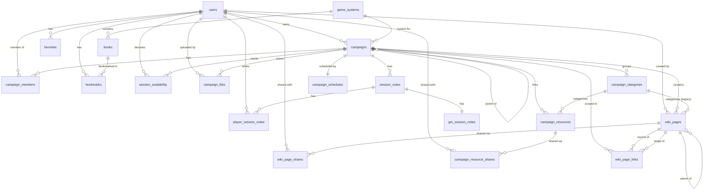

# Data Model Reference

A map of Grimoire's database schema - the tables, their foreign-key relationships, and
the notable constraints. The schema is defined by the SQLAlchemy models in
[`backend/models/`](../backend/models/) (`library.py`, `media.py`, `users.py`,
`campaigns.py`, `settings.py`); this document is a companion reference, so **keep it in
sync when you change a model**.

The backend runs on SQLite. All primary keys are 36-char UUID strings (`_uuid()`) except
`app_settings`, which is keyed by its `key` string. Timestamps are UTC (`_utcnow()`).

## Entity-Relationship Diagram

The diagram groups tables by their model file. Solid lines are foreign keys; the crow's-foot
end marks the "many" side. Media tables (`generic_maps`, `tokens`, `audio`) and the
`*_folders` tag tables have no foreign keys - they are linked to campaigns only indirectly,
through `campaign_resources` (a polymorphic `resource_type` + `resource_id`, not a real FK),
so they are omitted from the relationship graph for clarity.

## Foreign keys

There are 32 `ForeignKey` declarations across the models, plus the two self-referential
keys (`campaigns.parent_campaign_id`, `wiki_pages.parent_id`) and the polymorphic soft
links from `campaign_resources`/`favorites`, which are *not* declared foreign keys.

| From (table.column) | To (table.column) | Notes |
| --- | --- | --- |
| `books.game_system_id` | `game_systems.id` | nullable; a book may be unassigned |
| `bookmarks.user_id` | `users.id` | |
| `bookmarks.book_id` | `books.id` | |
| `favorites.user_id` | `users.id` | `item_id` is a soft link (not a FK) |
| `campaigns.owner_id` | `users.id` | the GM / creator |
| `campaigns.parent_campaign_id` | `campaigns.id` | self-referential; nullable |
| `campaigns.system_id` | `game_systems.id` | nullable; falls back to `system_name` |
| `campaign_members.campaign_id` | `campaigns.id` | |
| `campaign_members.user_id` | `users.id` | |
| `campaign_resources.campaign_id` | `campaigns.id` | |
| `campaign_resources.category_id` | `campaign_categories.id` | nullable |
| `campaign_resource_shares.resource_id` | `campaign_resources.id` | |
| `campaign_resource_shares.user_id` | `users.id` | |
| `campaign_categories.campaign_id` | `campaigns.id` | |
| `campaign_files.campaign_id` | `campaigns.id` | |
| `campaign_files.uploaded_by_id` | `users.id` | nullable |
| `campaign_schedules.campaign_id` | `campaigns.id` | one-to-one (`unique`) |
| `session_notes.campaign_id` | `campaigns.id` | |
| `session_availability.campaign_id` | `campaigns.id` | |
| `session_availability.user_id` | `users.id` | |
| `player_session_notes.session_id` | `session_notes.id` | |
| `player_session_notes.user_id` | `users.id` | |
| `gm_session_notes.session_id` | `session_notes.id` | one-to-one (`unique`) |
| `wiki_pages.campaign_id` | `campaigns.id` | |
| `wiki_pages.created_by_id` | `users.id` | nullable |
| `wiki_pages.parent_id` | `wiki_pages.id` | self-referential; nesting |
| `wiki_pages.category_id` | `campaign_categories.id` | legacy; nullable |
| `wiki_page_shares.page_id` | `wiki_pages.id` | |
| `wiki_page_shares.user_id` | `users.id` | |
| `wiki_page_links.campaign_id` | `campaigns.id` | |
| `wiki_page_links.source_page_id` | `wiki_pages.id` | |
| `wiki_page_links.target_page_id` | `wiki_pages.id` | |

## Table reference

### Library - [`backend/models/library.py`](../backend/models/library.py)

| Table | Purpose | Key columns / constraints |
| --- | --- | --- |
| `game_systems` | A TTRPG system (D&D 5e, PbtA, …). | `name`, `slug` unique. `is_system_agnostic` flags cross-system content. |
| `books` | One PDF/document in the library. | `filepath` unique. `game_system_id` FK. Index `ix_books_indexer_queue` on `(indexed, mime_type)` drives the indexer. `indexed`/`index_failed`/`is_missing` track scan state. `index_error` holds the failure message, or the sentinel `image-only` (no text layer, OCR unavailable) / `ocr` (indexed via OCR). `ocr_pending` (indexed `ix_books_ocr_pending`) flags a scanned PDF queued for deferred OCR; `ocr_pages_done` is the per-page OCR checkpoint so a long book resumes rather than restarts after an interruption. `ocr_dpi` is an optional per-book OCR resolution override (NULL = global `OCR_DPI`), set when a book is re-OCR'd at a higher DPI via `POST /api/books/{id}/reindex`. |
| `book_folders` | Tags auto-applied to a book subcategory folder path. | `path` unique. |

### Media - [`backend/models/media.py`](../backend/models/media.py)

None of these tables carry foreign keys; they are linked to campaigns polymorphically via
`campaign_resources`.

| Table | Purpose | Key columns / constraints |
| --- | --- | --- |
| `generic_maps` | A map image not tied to a system. | `filepath` unique. |
| `tokens` | A token image for use on maps. | `filepath` unique. `is_explicit` gates by user preference. |
| `audio` | An audio track. | `filepath` unique. Embedded metadata (`title`, `artist`, `duration`, …) populated by the indexer. |
| `map_folders`, `token_folders`, `audio_folders` | Tags auto-applied to a media folder path. | `path` unique. |

### Users - [`backend/models/users.py`](../backend/models/users.py)

| Table | Purpose | Key columns / constraints |
| --- | --- | --- |
| `users` | An authenticated account. | `username` unique; `email`, `opds_token`, `oidc_subject` unique + indexed. `role` ∈ `admin`/`gm`/`player`/`guest`. `is_guest` marks campaign-scoped guest accounts. |
| `bookmarks` | Per-user page/text bookmark in a book. | FKs `user_id`, `book_id`. Index `ix_bookmarks_user_book` on `(user_id, book_id)`. |
| `favorites` | Per-user favorite across books/maps/tokens. | FK `user_id`. Polymorphic `(item_type, item_id)`. **Unique** `(user_id, item_type, item_id)`. |

### Campaigns - [`backend/models/campaigns.py`](../backend/models/campaigns.py)

| Table | Purpose | Key columns / constraints |
| --- | --- | --- |
| `campaigns` | A GM-run or personal campaign. | FKs `owner_id`, `parent_campaign_id` (self), `system_id`. `system_name` is a free-text fallback when `system_id` is null. |
| `campaign_members` | A player invited to / in a campaign. | FKs `campaign_id`, `user_id`. **Unique** `(campaign_id, user_id)`. `guest_code` (indexed) mints guest tokens. |
| `campaign_resources` | A book/map/token/file linked to a campaign. | FK `campaign_id`, `category_id`. Polymorphic `(resource_type, resource_id)`. **Unique** `(campaign_id, resource_type, resource_id)`. `visibility` ∈ `public`/`private`/`gm`. |
| `campaign_resource_shares` | A user a `private` resource is shared with. | FKs `resource_id`, `user_id`. **Unique** `(resource_id, user_id)`. |
| `campaign_categories` | GM-defined grouping for notes or resources. | FK `campaign_id`. `kind` ∈ `note`/`resource`. |
| `campaign_files` | A GM-uploaded file attached to a campaign. | FKs `campaign_id`, `uploaded_by_id`. Surfaced via `campaign_resources(resource_type='file')`. |
| `campaign_schedules` | Session recurrence definition. | FK `campaign_id` **unique** (one-to-one). |
| `session_notes` | Notes for one session of a campaign. | FK `campaign_id`. |
| `player_session_notes` | Per-player scratch pad for a session. | FKs `session_id`, `user_id`. **Unique** `(session_id, user_id)`. |
| `gm_session_notes` | GM internal + shared notes for a session. | FK `session_id` **unique** (one-to-one). |
| `session_availability` | A user's availability for a session date. | FKs `campaign_id`, `user_id`. **Unique** `(campaign_id, user_id, session_date)`. |
| `wiki_pages` | A markdown wiki page in a campaign. | FKs `campaign_id`, `created_by_id`, `parent_id` (self), `category_id` (legacy). **Unique** `(campaign_id, slug)`. `visibility` ∈ `gm`/`group`/`members`. |
| `wiki_page_shares` | A user a `members` wiki page is shared with. | FKs `page_id`, `user_id`. **Unique** `(page_id, user_id)`. |
| `wiki_page_links` | Resolved `[[wiki link]]` for backlinks. | FKs `campaign_id`, `source_page_id`, `target_page_id`. **Unique** `(source_page_id, target_page_id)`. Rebuilt on every page save. |

### Settings - [`backend/models/settings.py`](../backend/models/settings.py)

| Table | Purpose | Key columns / constraints |
| --- | --- | --- |
| `app_settings` | Application-wide key/value settings. | Primary key `key` (string); `value` is text. |

### Full-text search (not an ORM table)

| Table | Purpose | Notes |
| --- | --- | --- |
| `book_search` | FTS5 virtual table for in-book page search. | Created in [`backend/models/db.py`](../backend/models/db.py) as `fts5(book_id UNINDEXED, page_number UNINDEXED, content, tokenize='porter unicode61')`. Populated by the indexer; `book_id` is a soft reference to `books.id`. |

## Cascades and deletes

Cascade behavior lives in the SQLAlchemy relationships, not in database-level
`ON DELETE` clauses. Deleting a `Campaign` cascades (`all, delete-orphan`) to its members,
resources, session notes, schedule, availability, wiki pages, categories, and files.
Deleting a `GameSystem` cascades to its books. Deleting a `SessionNote` cascades to its
player notes and GM note; deleting a `WikiPage`/`CampaignResource` cascades to its shares.
Other relationships (e.g. `users` → `bookmarks`) have **no** cascade, so those rows must be
cleaned up explicitly.
